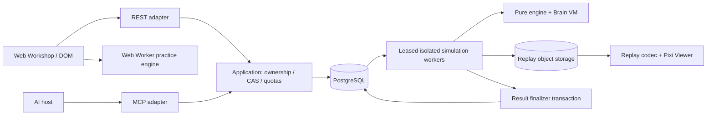

# 04 — Kiến trúc phần mềm và dữ liệu

**Mục tiêu:** một engine dùng offline/browser-worker/server; một application layer cho REST và MCP; renderer chất lượng cao không quyết định gameplay. Kiến trúc mô-đun để tăng công suất bằng worker trước khi tách nhiều service. Không thừa kế deployment claims v1. Sổ chọn stack ở [DECISIONS](DECISIONS.md).

## 1. Stack được chọn

| Tầng | Chọn | Lý do và rủi ro |
|---|---|---|
| Toolchain | TypeScript strict, Node24 LTS, pnpm10 workspace | Một ngôn ngữ từ schema/CLI/server; Agent T01 pin exact patch hiện hữu và lockfile, không invent version |
| Engine | Pure TypeScript integer helpers, BigInt intermediate | Debug/AI authoring dễ, cross-platform; phải benchmark, không coi JS float là fixed point |
| Web | React19 + Vite + DOM/CSS tokens | Editor/trace/forms accessible, không React render60Hz toàn app |
| Renderer | PixiJS8, WebGL2 baseline | Sprite batching, shader/VFX, texture atlas; WebGPU tùy chọn sau, không required |
| Server | Node24 + Fastify5, application services thuần | Một origin web/API/auth; protocol adapter MCP riêng |
| Data | PostgreSQL17 + SQL migrations/types | Transactions/locks cho revision, queue, rating; không hai database authority |
| Jobs | PostgreSQL leased jobs + outbox | Ít hạ tầng alpha; chuyển queue implementation qua port nếu đo contention |
| Replay/assets | S3-compatible object storage + CDN | Immutable chunks, range/cache; local MinIO trong dev |
| Auth | Better Auth + OAuth provider/MCP adapter đã xác minh | Spike T08 kiểm compatibility thực; không tự xây password/OAuth engine |
| Telemetry | OpenTelemetry + structured logs + Prometheus-compatible metrics | Trace API→job→match→storage; không log Brain/token |
| Test | Vitest, fast-check, Playwright, k6 | Golden sim, properties, UI flow, load; chọn suite có ý nghĩa |

T01 chốt exact versions vào packageManager/engines/lockfile và ADR compatibility. “Latest” không vào CI. Auth provider phải hỗ trợ authorization-code+PKCE, token audience và consent scope cần ở05; nếu plugin chưa tương thích MCP2 thì adapter chuẩn hoặc provider khác có ADR, không patch auth để ép chạy. SDK/extensions MCP peer mismatch được xử lý ở05, không trộn singleton package thiếu tương thích.

**Không chọn:** Unity/Godot Web export do nặng tải và bridge MCP/editor phức tạp; Phaser do phần gameplay loop custom deterministic khiến lợi ích framework nhỏ; Canvas2D làm renderer chính vì art pipeline/shaders/batching hạn chế, vẫn dùng debug renderer; Rust/WASM engine ngay alpha vì tăng compiler/ABI complexity trước benchmark. Nếu TS không đạt worker target, giữ ABI/fixtures, benchmark Rust/WASM spike và chỉ migrate khi parity hash đạt.

## 2. Luồng tổng thể



Local practice kết quả có nhãn `local/unofficial`; ranked finalizer chỉ nhận trusted worker artifacts gắn manifest. Web không được POST score rồi server tin. Control objective/ring poses từ engine snapshots, không renderer recompute với ruleset mới.

## 3. Monorepo và import boundaries

```text
apps/
  web/                  React shell + routes, editor DOM/canvas integration
  api/                  HTTP/auth/MCP composition root
  sim-worker/           job lease/process supervisor/result artifact writer
  cli/                  validate/simulate/experiment/verify
packages/
  contracts/            schemas/types/canonical codecs/errors (zero I/O)
  content/              catalog/rulesets/release digests/reference bots
  brain/                parse/typecheck/compile/VM/source maps
  engine/               world/phases/geometry/collision/resources/objective
  replay/               manifest/codec/hash/seek/public projection
  application/          use cases/ACL/ports/idempotency/ranked policy
  persistence/          PG ports/migrations/outbox
  mcp-adapter/           tools/protocol mapping, no game rules
  renderer/             Pixi scene/VFX/director/camera, no game mutation
  design-system/        DOM components/tokens/localization
  testkit/              fixtures/seeds/fault injection/perf harness
assets/source/          authored art/audio + license manifest
assets/generated/       packed atlases/audio metadata
docs/                   active v2 + archive
```

Allowed imports: contracts←content/brain; engine→contracts/content/brain; replay→contracts (verifier composition CLI có thể dùng engine); application→contracts/replay/interfaces, không renderer; persistence→application ports; mcp→application/contracts; renderer→contracts/replay; web→renderer/design-system/contracts, dynamic worker entry→engine/brain/content. Không web main bundle import engine interpreter hoặc adapter từ backend. Các packages pure không Node builtins/fetch/time/env. Dependency lint T01 chặn cycles/cross-internal imports.

## 4. Engine numeric ABI và deterministic runtime

Positions milli-unit integer, velocity milli-unit/s, angle0..4095 (full circle), scale multipliers1000, tick int. Intermediate products, squared lengths, dot/cross và damage phân phối dùng signed64 **BigInt** hoặc helpers kiểm safe range; serialized values phải nằm int32/uint32 schema trước convert Number. Không dùng bitwise JS để giả64-bit, không `Math.sin/cos/random`, wall clock hay hash-map iteration không sort trong engine.

Sin/cos LUT 4096 entries scale1,000,000 được offline generate một lần, version/hash và lưu content. `isqrt` floor integer; angle quantization `atan2` qua integer lookup/compare, tie nearest lower index theo canonical signed interval. Rotation/trig multiply truncate về0; damage nonnegative floor; sums dùng wide intermediate. Mỗi numerical helper có vectors negative/max/remainder. Vận tốc tích phân giữ remainder theo trục/rotation trong state checkpoint; không đổi integration dựa frame rate.

PRNG `xoshiro128**` uint32 bốn word, seed derivation SHA256(matchSeed,subsystemTag); chỉ seed deterministic, explicit unsigned operations. Engine, experiment spawn và presentation dùng stream tags riêng. Alpha ranked arena cố định không roll crit. RNG state phải checkpoint/hash. SHA dùng canonical bytes, không locale JSON sorts. Entity spawn ordinal và contact iteration là hợp đồng engine, thay đổi tạo engineDigest mới.

## 5. Database model và quyền dữ liệu

| Table | Key/index/ràng buộc |
|---|---|
| users, auth_* | Provider migrations; không token trong game logs |
| bots | id,owner_id,revision,definition JSONB,visibility,updated_at; unique owner+id |
| packages | package_hash PK,canonical bytes/object ref,compiler/catalog digests; append-only |
| bot_versions | bot_id,version_seq,package_hash,parent_hash,presentation_hash; unique bot+seq |
| validations | id,package_hash,engine/ruleset/suite digest,status,report; unique tuple |
| experiments | id,owner_id,manifest_digest,status,seedset hash,aggregate ref |
| jobs | id,type,input_manifest_hash,state,lease_token,lease_until,attempts; partial index queued |
| outbox | id,event_type,payload,state; write cùng transaction yêu cầu job |
| ranked_entries | season,user,package_hash,status,eligibility; one active per user+season |
| series | id,season,participants,package hashes,policy digest,status; unique queue match token |
| legs | series_id,leg_index,manifest_hash,result,replay_ref; unique series+leg |
| ledger_runs | run_id,season,version,parent_run_id,status,settle_watermark; unique season+version, active pointer trong season |
| rating_events | run_id,season,series_id,user_id,settle_sequence,before,delta,after; unique run+series+user; original run append-only |
| ratings | run_id,season,user_id,rating,played,wins,draws,revision; PK run+user; reads chọn active run |
| ranked_reviews | review_request_id,user_id,client_id,grant_id,package_hash,season,policy_digest,state,revision,expires_at; CAS machine05 |
| approval_intents | review_request_id UNIQUE,token_digest,user,client_id,grant_id,package_hash,season,policy_digest,state,revision,expires_at,consumed_at |
| request_dedup | subject_id,client_id,tool_name,key,payload_hash,response_ref,expires; unique tuple theo05 |
| audit_events | actor,action,resource hash,timestamp; redact private source |

Owner check trong application cho every use case và query, trước pagination/analytics. Admin content/auth rights tách khỏi game worker. JSONB draft không authority để worker đọc “latest”: manifest pin package immutable. Row-level policy phòng thủ thêm, không thay ACL tests. Package raw chứa Brain private; object key hash không là permission.

## 6. Job state machine và hoàn tất kết quả

`queued → leased → running → artifactReady → completed`; failed/cancelled terminal cho practice; official infraFailure vào retry queue tối đa3 attempts cùng manifest rồi quarantine/void series chưa rating. Worker polls `FOR UPDATE SKIP LOCKED`; lease30s, heartbeat5s, attempt-specific fencing token. Worker concurrent mặc định `max(1,min(4,vCPU-1))`, giữ RAM budget và API headroom, đo trước tăng.

Worker supervisor spawn job process không network, no secrets, filesystem readonly + temp sandbox, OS memory/CPU/wall limits. Manifest bytes + approved engine/catalog artifacts qua read-only inputs; output bounded. DSL không arbitrary code nhưng parser/engine bug vẫn cần isolation. Process worker_thread một mình không là security boundary. Object upload do supervisor ngoài sandbox qua service identity, worker chỉ xuất artifact.

Digest chỉ chứng minh equality, không provenance. Release manifest chứa engine/compiler/catalog/image digests được ký bởi CI release identity; supervisor verify trusted key+signature+allowlist trước chạy, không chỉ so chuỗi digest client gửi. Keys signing result/release tách riêng, keyId+validity window+rotation/revocation list lưu audit; giữ public verify keys cho replay lịch sử, revoked compromised results bị đánh dấu và dispute workflow07. T09 test tamper/mismatched digest/untrusted key; worker không có private signing key hay object credentials.

Finalize flow: write artifact temp key attempt→verify schema/digest/manifest→atomic immutable object commit→transaction check current fence/series manifest→store leg + enqueue finalization. Duplicate/stale worker không overwrite leg. Series chỉ final khi hai leg đúng, artifacts đủ và policy match. Transaction lock users rating theo sorted user IDs, insert unique rating events và update cả hai, set series settled, outbox leaderboard. At-least-once job delivery + idempotent finalizer; không claim distributed exactly-once execution.

Nếu DB commit fail sau object upload, retry finalize; orphan objects cleanup sau7 ngày chỉ không có ref. Nếu object missing, không rating dù worker báo score. Crash sau rating transaction và trước outbox publish: dispatcher retry, rating không apply lại. T10 fault injection phải chứng minh từng điểm crash.

Rating correction tạo ledger_run mới từ settle_sequence/watermark theo07; original events không mutate. Settlement transactions luôn pin active run và season revision under lock; maintenance pause admission+settlement, drain hoặc quarantine in-flight trước lấy watermark. Build candidate ratings/events/snapshot, kiểm completeness, atomically switch active run+snapshot+season revision, rồi reopen. Retry correction cùng run_id không nhân sự kiện; rollback pointer chỉ khi chưa reopen hoặc phải replay catchup có ADR. Không thêm series “lọt” vào old run khi đang recompute.

## 7. Replay và privacy

`MatchManifest`: engineDigest, rulesetDigest, catalogDigest, brainAbi/compilerDigest, packageHashes A/B, seed, arenaDigest, spawnSlotAssignment, maxTicks, numericalAbiVersion. Operational ID/timestamp không vào simulation hash. Season/series policy digest ở outer official manifest. Preserve engine container/build artifact và catalog để verify trận cũ.

Thêm `arenaInitDigest,scenarioId,presetValues` theo seed 128bit→preset02; initialstate explicit để verifier check derivation. Poseframes đánh dấu `tickBoundaryN`, events dùng tickindex0..5399 theo02; chunk decoder/seek không nhầm boundary với decisiontick. Full init parameters và spawnSlotAssignment (leg0Aleft/Bright,leg1Aright/Bleft) vào manifestDigest, không chỉ labelarena.

Public replay chunks **1 giây/60 ticks** chứa poses/module HP/public phases/projectiles/control/ring/events, index seek theo tick; không Brain variables/intents chưa thể thấy, exact enemy energy hay private source. Codec đầu: versioned binary little-endian typed fields, zstd server; browser decoder thực tồn tại, T06 spike; nếu chưa có decoder đạt parity dùng gzip+bounded JSON chunks có ADR, không block gameplay vì compression.

Checkpoints internal mỗi60 ticks chứa full engine state incl resources/VM/RNG/remainders/active instances. Chúng private, không CDN public. **Viewer seek bằng public pose chunks**, không re-simulate Brain địch. CLI full verify cần cả packages private: owner chỉ verify cùng source authorized; public verifier kiểm manifest signature/chunk integrity và pose continuity, không pretend tái mô phỏng khi thiếu Brain. Operator audited verifier có đầy đủ access.

`simulationHash` hash canonical full engine outcome/state (private nội bộ); `publicReplayHash` hash public projection ordered chunks; `privateTraceHash` riêng. Signature Ed25519 official envelope `{seriesId,legIndex,manifestDigest,publicReplayHash,resultDigest,keyId}`; ký qua finalizer key service, không trong sim worker. Manifest public chỉ packageHashes + public Body/presentation, không canonicalGameplay chứa Brain. Người dùng có nguồn public mới full replay CLI parity.

Trần alpha: public replay≤8 MiB/leg, private artifact≤16 MiB/leg, projected event≤256/tick, projectile≤128 global. Engine entity quota thuộc luật catalog; replay exceeds storage budget là infra/content defect cần quarantine, không silently drop combat event. Cosmetic VFX giảm cấp được, authority event không được cắt để benchmark đẹp.

## 8. Frontend runtime

React state chỉ data/forms/control UI; Pixi ticker render scene graph, không setState per frame. Practice engine trong Web Worker, dùng same packages và budgets; worker chết hiển thị lỗi retry, không giả match loss. Server job SSE notification hoặc poll trạng thái; có cursor/reconnect cho progress. Official alpha computed replay rồi phát, UI nhãn **“Trận đã tính — phát lại”**, không fake live.

Asset tiers high/medium/low, DPR cap2, texture atlases≤2048² baseline; lazy load arena/viewer. WebGL context loss: pause playback giữ tick, restore assets, seek tới tick; unsupported WebGL: DOM combat summary và debug Canvas2D low renderer nếu có, không page blank. Renderer không nhận private checkpoint. Bỏ FPS ảnh hưởng sim; paused/tab hidden không đổi ranked result.

## 9. Dev, deploy và vận hành

T01 tạo `pnpm install --frozen-lockfile`, `pnpm dev`, `pnpm check`, `pnpm test:unit`, `pnpm test:sim`, `pnpm test:e2e`, `pnpm build`, `pnpm verify:replay`. G1 đã thay deferred bằng spatial/combat/corpus checks và replay checks; `test:e2e` vẫn là HTTP smoke, chưa là full player flow T07. Compose G0 có postgres/minio; API/web qua `pnpm dev`, isolated simulation worker ởT10. Setup exact runtime ở [G0 Development](G0_DEVELOPMENT.md), headless/debug G1 ở [G1 Development](G1_DEVELOPMENT.md); public secrets ngoài git, `.env.example` chỉ names/non-secret defaults. CLI offline không cần auth/network.

Một origin production `play.<domain>` phục vụ web,/api,/auth,/mcp qua reverse proxy HTTPS; không quyết định production domain từ claims v1. Static CDN cache immutable hashed assets, auth/MCP/API private no-store, replay URLs phải kiểm ACL. Dev/staging/prod separate credentials/buckets/DB. Migrations expand→deploy compatible→backfill→contract lần sau, rollback image không undo DB destructive migration.

Alpha deployment2 API replicas nếu HA cần, workers independently scaled, managed PG/object storage ưu tiên giảm ops; một VPS compose dùng được closed test nhưng không gọi HA. Không Kubernetes/Redis bắt buộc. Compute capacity theo measured sec/leg×arrival, object bytes×retention, DB tx rate; scale workers nếu CPU-bound, không tăng API replicas để chữa simulation chậm.

Metrics: queue_wait, sim_wall, step_duration, gas, fault type, worker retry, public replay bytes, DB locks, finalize duplicate, auth failures, rate-limit. Logs correlation user pseudonym/job/manifest, không source/token/email. Dashboard+alerts khi queuep95>30s hoặc error>1%10 phút; alpha service objectives ở09 là target cần load test.

Global backpressure baseline: compile concurrent≤8,pending≤64; Lab queued≤200,Ranked queued≤100,subject queue limits05 luôn áp trước. Nếu cap đạt trả retryAfter/backpressure **trước reservation/side effect**, không grow queue vô hạn. Một progress SSE/user,global100 connections/API instance; poll rate-limited. Metrics điều chỉnh cap sau load test có config version, không tăng arbitrary khi bị spam. Trace/event/storage budgets04§7 vẫn bắt buộc dưới saturation; release balance batches chạy CLI offline/CI budget riêng, không bypass user quotas qua MCP tool.

Backup PG PITR nếu provider hỗ trợ, daily snapshots tối thiểu, object versioning; closed-alpha RPO≤24h/RTO≤4h, trước ranked public nâng target bằng drill. Restore staging và so package/ref/rating ledger bắt buộc; file backup tồn tại chưa đủ. Incident pause submissions, drain/quarantine jobs, preserve artifacts, restore/update ledger audit; không đổi kết quả lịch sử âm thầm.
