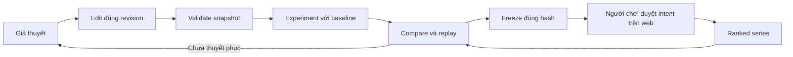

# 05 — MCP Platform: AI đồng thiết kế, người chơi quyết định Ranked

**Trạng thái:** Đặc tả thiết kế v2; chưa triển khai hay kiểm thử runtime.  
**Ngày nghiên cứu:** 2026-10-01.  
**Ranh giới:** MCP thiết kế và phân tích trước/sau trận; server thực thi chiến đấu tự chủ. Quy tắc gameplay và schema chuẩn nằm ở [02_GAMEPLAY](02_GAMEPLAY.md), [03_BOT_BRAIN](03_BOT_BRAIN.md); vận hành ở [04_ARCHITECTURE](04_ARCHITECTURE.md), Ranked ở [07_RANKED_LIVEOPS](07_RANKED_LIVEOPS.md).

## 1. Quyết định nền tảng

AI là kỹ sư cùng người chơi: biến giả thuyết thành bản chỉnh có thể xem, chạy thí nghiệm có đối chứng, giải thích bằng bằng chứng rồi đề xuất một phiên bản. MCP không có tool điều khiển trận, đọc Brain đối phương hay thay engine. Web Lab và MCP gọi **cùng Application Service**, cùng quyền, validator, quota và dữ liệu PostgreSQL. Thay AI host không thay bot hay rating.

Giữ bốn cam kết: co-create qua MCP, autonomous combat, bảng xếp hạng authoritative, trí tuệ bot mở rộng bằng bộ lệnh được kiểm duyệt. Giữ Brain riêng tư theo mặc định; người chơi sở hữu bản thiết kế và lịch sử của mình. Thuê bao/cosmetic không tăng ngân sách module, sensor, Brain fuel hay lợi thế ghép trận.

Hướng triển khai: Node.js + TypeScript service, PostgreSQL giữ trạng thái có thẩm quyền, object storage giữ replay, worker cô lập thực thi sim. MCP là adapter của service, không chạy simulation trong HTTP handler. Adapter modern dùng SDK v2; MCP App là view tùy chọn dùng lại Battle/Replay Viewer.

## 2. Vòng lặp co-create có chứng cứ

Ví dụ: “Giấu propulsion sâu hơn sẽ giảm mất cơ động trước Flanker, nhưng có thể làm xoay chậm.” AI ghi giả thuyết, baseline và metric trước khi chạy; tạo candidate; validate; dùng cùng suite, seed và hai vị trí xuất phát cho baseline/candidate; đọc replay ở các mốc mất module. Kết quả báo thắng/hòa/thua, khoảng bất định và chi phí; không tuyên bố “tốt hơn” từ một trận thuận lợi. Nếu chỉ thử một matchup, kết luận chỉ áp dụng matchup đó.

Mỗi `ExperimentSpec` giữ `hypothesis` (1–1.000 ký tự), `baseline`, `candidate`, `suiteId`, `suiteDigest`, `seedSetId`, `seedSetDigest`, `metrics` (1–8 ID trong catalog), `decisionRule` (JSON theo schema catalog), `maxExecutions`. Agent không gửi tên metric tùy ý để server tự suy diễn. Suite gồm đối thủ tham chiếu được công bố hoặc package mà caller được phép dùng; không lấy private package người khác chỉ bằng hash. Mirroring là mặc định của suite; một cặp mirrored legs dùng cùng seed. Engine/ruleset được pin khi nhận job. Suite chốt holdout tách khỏi seed tuning; report ghi rõ `exploration` hay `holdout` để không dùng tuning thành bằng chứng tổng quát.

Thí nghiệm chạy snapshot bất biến của revision tại lúc nhận job, dù người chơi sửa nháp sau đó. So sánh không lấy “latest” hay trộn engine/ruleset khác nhau. AI trình bày diff cơ thể/Brain, cái được và cái mất, tối đa ba replay đoạn tiêu biểu có `tickRange`; người chơi xem được bản đổi ngay trong Lab. Các ghi chú AI là nội dung không tin cậy, không biến thành chỉ thị backend.

## 3. Discovery: AI đọc đủ để làm đúng

Các đường dẫn dưới đây là **hợp đồng cần triển khai**, chưa phải endpoint deployed. Origin được công bố bởi cấu hình deployment, không hardcode host demo thành host v2.

| Điểm truy cập | Nội dung và quyền |
|---|---|
| `/agent.md` | Tài liệu public: luật vòng lặp, MCP URL, auth discovery, các scope, limits, trình tự tạo/validate/experiment/freeze, Ranked cần human intent; không có token |
| `/rules` | Ruleset hiện hành + các version được lưu, glossary đơn vị, ID registry đã review, ví dụ nhỏ và skill catalog |
| `/schemas/v2/bot-definition.json` | JSON Schema 2020-12 của `BotDefinition` 2.0 theo doc 03 |
| `/schemas/v2/brain.json` | Schema Brain typed FSM/skills/macros, sensor/action registry, limits theo doc 03 |
| `/schemas/v2/bot-package.json` | Schema package, canonicalization và hash semantics theo doc 03 |
| `/schemas/v2/experiment.json`, `/schemas/v2/replay.json` | ExperimentSpec, ComparisonReport, ReplayManifest và projection public/private |
| `/mcp` | Streamable HTTP, capability discovery và tool contracts |

`server/discover` và `tools/list` là protocol discovery. `/agent.md` là onboarding của sản phẩm, không thay protocol discovery. Agent đọc `get_rules` trước chỉnh bot; output gồm schema IDs/digests, registry digest, limits, scope map, suite catalog và migration notes. Tài liệu public được cache theo version; dữ liệu người chơi được cache private và luôn kiểm quyền khi đọc.

Resources có URI versioned, ví dụ `promptchien://rules/{rulesetDigest}`, `promptchien://schemas/{schemaDigest}`, `promptchien://bots/{botId}/revisions/{revision}/summary`, `promptchien://replays/{replayId}/manifest`. Review có resource `promptchien://ranked/reviews/{reviewRequestId}` chỉ caller/grant đã tạo request đọc được với `ranked:prepare`; nội dung `{reviewRequestId,status,packageHash,seasonId,queuePolicyDigest,expiresAt,approvalHandle?}`, `status` thuộc `awaiting_human|approved|consumed|revoked|expired`, chỉ `approved` có handle, `ttlMs:0,cacheScope:private`. Đây là URI logic của server; không suy ra đường dẫn filesystem hay cấp quyền từ URI. Brain resource chỉ owner/collaborator có `brains:read`. Prompts tùy chọn `design_hypothesis`, `analyze_replay`, `compare_candidates` hướng dẫn thao tác và giới hạn; không cấp thêm quyền. Tên, mô tả, order tool ổn định, error có recovery cụ thể, trả dữ liệu nhỏ đủ cho agent tránh đoán schema.

## 4. Hợp đồng chung của tool

### 4.1. Kiểu và giới hạn

Schema nhập/xuất có ID/version độc lập với protocol version; tất cả object đóng (`additionalProperties:false`) ngoại trừ map mở được schema cho phép. ID handle do server mint, 1–128 ký tự ASCII; identifiers module/Brain dùng grammar≤48 ký tự của doc03; không coi ID khó đoán là authorization. Digest là SHA-256 lowercase 64 hex. Revision là số nguyên dương, tăng đơn điệu theo bot; thời gian ISO-8601 UTC. Tên bot NFC/plain text 1–64 Unicode scalar; mô tả 0–2.000 ký tự. Request JSON tối đa **256 KiB chưa nén** và nesting32 theo doc03, gồm cả definition/envelope; đây là giới hạn đầu vào, không thay gameplay budget.

`TargetRef` là union: `{kind:"draft",botId,revision}` hoặc `{kind:"package",packageHash}`. Mọi chỗ dùng draft đều yêu cầu revision chính xác; server không tự chọn latest. `VersionBinding` là `{engineDigest,rulesetDigest,catalogDigest,schemaVersion,brainAbiVersion,compilerDigest}` theo field names doc03; suite thêm `suiteDigest`. Catalog là registry reviewed mechanics của platform. Chỉ nhận digest tồn tại trong registry được kiểm duyệt. Handler resolve từ ID có quyền; không tải URL/package/schema tùy ý do model gửi.

Tools thành công trả `structuredContent` khớp `outputSchema` và text ngắn diễn giải trạng thái. Các output là object để dễ tương thích host. Ví dụ output common của job: `{jobId,status,kind,targetHashes,binding,completedExecutions,totalExecutions,reservedExecutions,pollAfterMs,cancelAllowed}`; `targetHashes` đều là snapshot thực sự được chạy. Không bọc thành công giả khi tool thất bại.

### 4.2. Quyền theo scope và ACL

| Scope | Quyền |
|---|---|
| `rules:read` | Luật/catalog public; có thể anonymous |
| `bots:read` | Bot metadata/body của owner hoặc người đã được chia sẻ |
| `brains:read` | Source/IR/trace riêng của bot được cấp quyền; không suy ra từ `bots:read` |
| `bots:write` | Tạo/edit nháp được phép; edit Brain thuộc bot có quyền sửa |
| `experiments:run` | Validate/run/cancel jobs thuộc caller, trong quota |
| `replays:read` | Replay projection caller được phép; không gồm Brain private |
| `ranked:prepare` | Tạo bản review request cho package own hợp lệ; không vào queue |
| `ranked:submit` | Submit kèm intent được người chơi duyệt; scope OAuth một mình chưa đủ |

Scope là điều kiện cần, ACL là điều kiện cần thứ hai. Mỗi call kiểm chủ sở hữu/collaborator, mùa, quyền đọc handle và trạng thái tài khoản. Scope `bots:write` không cấp thêm `brains:read`; việc sửa Brain không trả nguồn hiện tại nếu thiếu scope đọc. Admin quyền quản trị tách endpoint và role, không công bố tool “bypass validation/rank” cho agent.

### 4.3. Pagination, concurrency và chống gọi lặp

List mặc định 20, tối đa 50; replay events tối đa 200/event page và 64 KiB structured output/page. Output list `{items,nextCursor,snapshotId,expiresAt}`. Cursor opaque, ký/bind caller, projection, filter, sort, snapshot, expire 15 phút; không phải offset hay query SQL. Sort bot theo `(updatedAt DESC,botId)`; leaderboard theo snapshot ranking trong doc 07 với ID làm tie-break ổn định; events theo `(tick,eventIndex)`. Cursor hết hạn trả `CURSOR_EXPIRED`, agent bắt đầu lại. Không cắt JSON giữa chừng; dữ liệu lớn ở authorized resource/blob.

Edit truyền `expectedRevision`, ghi `UPDATE ... WHERE revision = expectedRevision` trong transaction. Conflict trả revision mới và URI diff có quyền; agent đọc lại, trình diff, rebase rồi dùng **key mới**, không ghi đè âm thầm. Validation/report luôn gắn snapshot hash + binding; sửa nháp làm eligibility của revision mới chưa đạt, không sửa report cũ.

Tất cả tool ghi/job tạo cần `idempotencyKey` là UUID. PostgreSQL unique theo `(subjectId,clientId,toolName,key)`; canonical request digest bao gồm target/binding/intent nhưng không token vận chuyển. Key giống + payload giống trả cùng result/handle; payload khác trả `IDEMPOTENCY_CONFLICT`. Lưu receipt ít nhất 7 ngày, Ranked receipt giữ hết mùa + thời hạn dispute; output có `dedupeUntil`. Các invariant dài hạn (unique queue/account, immutable package, ledger/series ID) vẫn chống duplicate sau retention. JSON-RPC request ID không thay idempotency key. Key receipt và side effect commit cùng transaction; receipt access phải reauthorize sau token revoke. Pending call trả handle cũ, không tạo job mới.

Annotations là gợi ý cho host, không là bảo mật. Read tools `readOnlyHint:true`; edit/cancel/submit `readOnlyHint:false`. Ghi có key được `idempotentHint:true` với điều kiện mô tả rõ; edit nháp/cancel có `destructiveHint:true`, create/freeze/run false. Tất cả domain tools `openWorldHint:false` vì chỉ thao tác dữ liệu/nội dung catalog của platform, không fetch arbitrary URLs. Các tool list/get không có side effect bắt queue. Cấp human intent không suy ra từ annotations hoặc host auto-approval.

### 4.4. Phân tầng lỗi

Expected domain failure: `isError:true`, `structuredContent:{error:{code,message,retryable,retryAfterMs?,fieldErrors?,currentRevision?,recoveryAction?},requestId}` và output schema mô tả union success/error. Field errors dùng JSON Pointer không chứa source Brain đầy đủ. Transport/auth/RPC failure giữ đúng lớp; không tất cả chuyển thành domain error.

| Mã domain | Hành vi và recovery |
|---|---|
| `REVISION_CONFLICT` | Đọc revision/diff mới, rebase rồi key mới |
| `VALIDATION_REQUIRED`, `VALIDATION_STALE` | Validate đúng snapshot và binding; không tự sửa engine |
| `VALIDATION_FAILED` | Đọc report, sửa pointer báo lỗi; không retry nguyên payload |
| `INCOMPATIBLE_BINDING`, `UNKNOWN_MECHANIC` | Đọc get_rules/catalog; reviewed registry mới cần package/validation mới |
| `QUOTA_EXCEEDED` | `retryAfterMs`/quota reset; không loop, không tạo account khác |
| `JOB_NOT_READY`, `JOB_TERMINAL`, `CANCEL_NOT_ALLOWED` | Poll theo hint hoặc lấy artifact terminal; không biến infra failed thành bot loss |
| `COMPARISON_NOT_COMPARABLE` | Output nguyên nhân mismatch, chạy matched plan mới |
| `APPROVAL_REQUIRED`, `APPROVAL_EXPIRED`, `APPROVAL_BINDING_MISMATCH` | Mở review request hợp lệ; AI không tạo/giả consent |
| `QUEUE_ALREADY_ACTIVE`, `SEASON_CLOSED` | Lấy Ranked status hoặc chọn mùa được mở |
| `CURSOR_EXPIRED`, `IDEMPOTENCY_CONFLICT` | Làm mới cursor / reconcile receipt rồi key phù hợp |
| `NOT_FOUND_OR_NOT_ALLOWED` | Cùng thông báo cho object không có hoặc không có ACL; không leak ownership |

Input sai schema/unknown tool là RPC error theo SDK; 401/403 là auth failure, header/version errors ở mục 10. Infra retry có backoff, key cũ, tối đa ba lần từ agent; vượt thì trả trạng thái để người chơi biết.

## 5. Tool surface v2

Đây là bộ công cụ theo workflow, không expose toàn bộ database. `K` = `idempotencyKey`; `B` = `VersionBinding`; `P` = `{cursor?,limit?}`; các alias expand thành field/schema chính thức khi implement. Output dưới đây là **success shape**; mọi tool dùng error union ở mục 4.4. Optional fields đánh dấu `?`, còn lại bắt buộc.

| Tool | Input | Output | Scope và lỗi đặc thù |
|---|---|---|---|
| `get_rules` | `{rulesetDigest?,catalog:"summary"\|"schemas"\|"mechanics"\|"suites",...P}` | `{binding,limits,entries,schemaRefs,nextCursor,snapshotId,expiresAt}`; `summary` luôn đủ bước khởi đầu | Public `rules:read`; unknown version |
| `list_bots` | `{view:"owned"\|"shared",...P}` | `{items:BotSummary[],nextCursor,snapshotId,expiresAt}`; không Brain | `bots:read`; cursor |
| `create_bot` | `{name,definition:BotDefinition,parentPackageHash?,K}` | `{botId,revision:1,snapshotHash,summary,diffUri,dedupeUntil}` | `bots:write`; schema, parent ACL, mechanic |
| `get_bot` | `{target:TargetRef,projection:"summary"\|"definition"\|"brain"}` | `{target,snapshotHash,binding,summary,definition?,brain?,validationRefs,packageHash?}` | `bots:read`; `brain` và full `definition` cần `brains:read`; ACL |
| `edit_bot` | `{botId,expectedRevision,patch:BotEditPatch,changeNote?,K}` | `{botId,revision,snapshotHash,diffUri,eligibility:"validation_required",dedupeUntil}` | `bots:write`; revision, patch, limit |
| `validate_bot` | `{target:TargetRef,binding:B,suiteId,suiteDigest,K}` | `JobReceipt`; artifact `ValidationReport` | `bots:read` + `experiments:run`; snapshot, suite, quota |
| `run_experiment` | `{spec:ExperimentSpec,binding:B,K}` | `JobReceipt`; artifact `ExperimentReport` | `bots:read` + `experiments:run`; reference ACL, maxExecutions, quota |
| `get_job` | `{jobId}` | `{job:JobReceipt,artifactRef?,error?,quotaSettlement?}` | Owner ACL + `experiments:run`; inaccessible handle |
| `cancel_job` | `{jobId,K}` | `{jobId,status:"cancel_requested"\|terminalStatus,quotaSettlement?,dedupeUntil}` | `experiments:run`; terminal/no cancel |
| `compare_experiments` | `{experimentIds:string[2..4],metrics:string[1..8]}` | `{comparison:ComparisonReport,evidenceRefs,limitations}` | `bots:read`; ACL, different bindings/plans |
| `freeze_bot` | `{botId,expectedRevision,validationId,expectedPackageHash,K}` | `{packageHash,sourceRevision,binding,validationId,publicProjectionHash,dedupeUntil}` | `bots:write`; stale report, hash/revision conflict |
| `prepare_ranked_submission` | `{packageHash,seasonId,queuePolicyDigest,K}` | `{reviewRequestId,reviewResourceUri,packageHash,seasonId,queuePolicyDigest,approvalUrl,expiresAt,status:"awaiting_human",dedupeUntil}` | `bots:read` + `ranked:prepare`; own package, eligibility |
| `submit_ranked` | `{packageHash,seasonId,queuePolicyDigest,reviewRequestId,approvalHandle,K}` | `{submissionId,queueEntryId,packageHash,seasonId,status:"queued",dedupeUntil}` | `ranked:submit` + own package + human intent; approval, queue, season |
| `get_ranked_status` | `{submissionId}` | `{submissionId,packageHash,seasonId,status,seriesId?,resultRef?,ratingTransactionId?,pollAfterMs}` | `bots:read`; own/shared-safe projection |
| `get_replay` | `{replayId,section:"manifest"\|"summary"\|"events"\|"owner_trace",tickRange?,...P}` | `{manifest?,summary?,events?,trace?,viewerUrl,artifactRefs,nextCursor?,snapshotId,expiresAt}` | `replays:read`; `owner_trace` thêm `brains:read` + own trace; range, ACL |
| `get_leaderboard` | `{seasonId,bracketId,...P}` | `{items,snapshotId,generatedAt,nextCursor,expiresAt,ratingPolicyDigest}` | Public projected data; no private packages/Brain |

`BotEditPatch` là bounded domain patch theo schema doc 03: thay một nhóm module theo ID, thay cấu hình Brain hoặc metadata được phép; ≤64 operations; từng operation typed, không JSON Pointer tùy ý xuyên ownership/hash/rating. Patch atomic: lỗi một operation thì không commit gì. Geometry có thể chưa qua gameplay validation ở nháp, nhưng phải qua schema/security limits trước lưu. Điều này cho phép AI dựng từng bước mà không lưu arbitrary code.

`definition` của `get_bot` là full schema chứa Brain; cần cả hai scope. `summary` là `PublicBotView`/owner summary cho body/metrics/version, không có Brain. Create/edit có thể nhận Brain người chơi chủ động đưa vào host; consent OAuth giải thích AI provider sẽ thấy nội dung đó. Không trả raw Brain trong tool errors, text summaries hay logs.

Không có `set_rating`, `control_match`, `read_enemy_brain`, `upload_executable`, `install_mechanic`. Khi thiếu UI, agent vẫn hoàn tất toàn bộ thiết kế/thí nghiệm/freeze bằng tools; bước human Ranked mở trang web của sản phẩm.

## 6. Freeze, canonical hash và admission Ranked

Hash `BotPackage` tuân **canonical gameplay payload** của doc03: body normalized + Brain IR + `schemaVersion,brainAbiVersion,compilerDigest,catalogDigest`, mọi reference canonicalized theo spec; cosmetic/name có `presentationHash` riêng. Không tự thêm timestamp, tên hiển thị, owner ID, validation ID, approval hay experiment note vào gameplay hash. Engine/ruleset/suite eligibility được binding trong `ValidationReport`; không lẫn approval với package identity. Server compile/canonicalize/tính hash, không tin hash client báo.

`validate_bot` normalize và lưu candidate snapshot bất biến với `expectedPackageHash`. `ValidationReport` bind `packageHash + engineDigest + rulesetDigest + suiteDigest` và registry/schema versions theo doc 03. Tất cả bắt buộc checks đạt mới eligible; report “job completed” chưa có nghĩa bot “passed”. `freeze_bot` đối chiếu expected revision, hash và report trong transaction rồi lưu immutable package. Freeze không vào queue, không đổi rating và không làm public Brain. Bot edit sau freeze tiếp tục tạo draft revision mới; package cũ giữ nguyên.

Admission kiểm lại tại submit: chủ sở hữu, account status, exact package/binding/report, mùa/ruleset/registry allowlist, reviewed mechanics, scope, quota queue và human intent. Official series gồm **hai legs mirrored cùng seed và hai package**, chỉ một transaction cập nhật rating sau series hợp lệ (doc 07). Không dùng “simulate rồi upload result” làm kết quả chính thức. Seed/matchmaker do server quyết định, agent không chọn đối thủ Ranked/seed.

### 6.1. Human approval là domain capability riêng

Không chấp nhận `{confirmed:true}`, câu nói AI tổng hợp hay OAuth consent tổng quát làm permission submit. Người chơi có quyền đã yêu cầu AI edit/simulate rộng rãi; hành động làm thay đổi queue/rating vẫn cần một **intent cụ thể** trước mỗi submission. Đây là luật sản phẩm cho runtime tương lai, không phải yêu cầu người dùng duyệt bộ tài liệu này.

1. AI gọi `prepare_ranked_submission`, nhận review request không có quyền submit. Request bind `{subjectId,clientId,oauthGrantId,packageHash,seasonId,queuePolicyDigest}`; expire 15 phút.
2. `approvalUrl` chỉ mở trang same-origin có xác thực. GET/open URL **không cấp quyền**. Trang hiển thị body, diff so với package trước, validation, mùa và hậu quả rating; không hiển thị source cho ai thiếu quyền. Referrer/no-store thích hợp; không token OAuth trong URL.
3. Người chơi bấm “Đưa phiên bản này vào Ranked” trong phiên web đã xác thực. POST same-origin + CSRF + Origin check tạo intent opaque random 256-bit server-side, bind các field trên, TTL **5 phút**, `maxUses:1`. Client/model không có tool tạo intent. Có nút hủy trước submit; request đã expire phải prepare lại.
4. Host/tools-only client lấy `approvalHandle` cho đúng review request qua completion được trả sau hành động web hoặc poll review resource có ACL ở mục3; handle không xuất trong public URL/log. MCP request chứng minh đúng OAuth grant và caller. Human fallback có thể submit trực tiếp từ web bằng cùng intent/service, không buộc host phải dùng Apps; service xác minh web owner và review binding thay OAuth bearer cho riêng đường web authenticated, không nhận mode này từ MCP.
5. `submit_ranked` consume intent, insert queue entry và lưu receipt atomically. Hai call khác key tranh intent chỉ một commit; call retry key cũ nhận receipt dù intent đã consumed. Scope `ranked:submit` bị revoke hoặc account bị khóa thì dừng trước commit. Không gia hạn/rebind tự động khi season/hash đổi.

Review row có state machine CAS `awaiting_human → approved → consumed` hoặc `revoked/expired`; **unique một intent cho một reviewRequestId**. POST approve lặp idempotent trả cùng handle/expiry đã mint, không tạo handle mới hoặc kéo dài TTL; không reapprove review consumed/revoked/expired. Approve/revoke/consume khóa cùng review+intent row trong transaction và kiểm state/revision; revoke thắng trước consume thì submit reject, consume thắng thì revoke không hủy series đã nhận. Submission khác cần prepare review mới và hành động người chơi mới. Test duplicate approval POST, concurrent approve/revoke/consume và replay approval sau series đầu settled.

Queue có unique active entry theo account/bracket theo doc 07; editing không thay package trong queue. Nếu mùa/ruleset đổi trước admission/matching, hủy entry theo chính sách công bố và hoàn quota; cần validate/intent mới, không tự migrate bot rồi đấu. Hủy queue có hành động web rõ ràng; match đã bắt đầu không được “cancel job” từ MCP. Ranked không thực thi continuation MRTR để điều khiển tick.

## 7. Jobs, quota và vận hành có thể phục hồi

`JobReceipt.status`: `queued → running → completed | failed | canceled`, có `cancel_requested` không terminal trong lúc worker dừng an toàn. Completion và cancel tranh nhau commit; job đã completed giữ result, cancel không xóa result. `completed` report có thể validation fail; `failed` là lỗi hạ tầng. `get_job` luôn trả progress/last updated/terminal reason có thể hiểu được; artifacts chỉ publish sau hoàn tất và integrity kiểm đạt.

API tạo job + reservation + transactional outbox trong PostgreSQL. Worker claim lease có fencing token; heartbeat, bounded retry, không làm process HTTP treo. Hết lease worker khác tiếp quản **cùng job ID và snapshot/seed**. Publication artifact và status commit dùng fencing token; upload dư thành orphan cleanup, không thay kết quả đã commit. Cancel ngắt request stream MCP không tự hủy domain job; phải gọi `cancel_job`. Lost stream/reconnect gọi lại bằng key cũ; polling/resume không phụ thuộc MCP session.

Worker chỉ nhận validated typed IR/registry artifacts đã pin, không token OAuth/cookie/secret app, không mạng outbound, filesystem tối thiểu read-only + scratch ephemeral, process/container memory/CPU/time limit. Brain vượt deterministic fuel xử lý bằng luật doc 03; worker OOM/crash/timeouts infrastructure làm **job failed/retry**, không ghi bot thua hay rating loss. Ranked workers và sandbox workers pool/priority riêng; saturation lab không chặn giải quyết Ranked.

Quota đề xuất ban đầu, cần load/cost measurement ở implementation gate:

| Hạn mức | Mặc định thiết kế |
|---|---|
| API read/write | 120 reads/phút, 30 writes/phút/subject; thêm cap theo client/IP chống abuse |
| Job concurrency | 2 sandbox jobs running, 4 queued/subject; 1 validation job running |
| Experiment | ≤2 variants; ≤128 executions/job; một leg = một execution, báo planned/reserved trước chạy |
| Daily lab | 256 executions/ngày/subject; validation suite có reservation riêng, tối đa 20 requests/ngày, không được spam để dùng thành optimizer miễn quota |
| Ranked | Một entry đang chờ/đang chạy theo account/bracket; submission cap do doc 07 quyết định; không thu lab credit cho official legs |

Quotas authoritative tại Application, cả web/MCP cùng ledger. Trước enqueue reserve planned executions; chỉ charge executions hoàn thành có report sử dụng được. Refund remainder khi cancel/infra fail, retries infra không charge lại. Quy định không retry validation failure nguyên payload để hút CPU. `quotaSettlement` ghi reserved/charged/refunded; `get_rules` công bố effective current limits/reset thay hardcode cho AI. AI không tự mua credit, tạo tài khoản mới hay chạy job vượt kế hoạch được người chơi đặt. Agent budget giới hạn số iteration và executions; hết budget dừng với candidate tốt nhất + limitations.

Telemetry lưu IDs/digests/status/cost, không Brain source, prompt, OAuth token hay approvalHandle. Audit dành cho owner ghi ai/client nào edit revision nào, validate/freeze/approve/submit lúc nào, package hash, receipt và series/rating IDs; approval có người chơi actor riêng với agent actor. Log retention/access/export theo doc 09.

## 8. Quyền sở hữu Brain và chia sẻ replay

Mặc định private: Brain source, lowered IR, parameters, owner decision trace, private experiment seed/suite composition do người chơi tự chọn. Public: body/module layout của package Ranked, tên creator, package hash, schema/registry/version IDs, kết quả series, rating, replay projection hành vi quan sát được. Hash là commitment, không là quyền download full package. Endpoint `GET /packages/{hash}` public chỉ trả `PublicBotView`; export full package cần owner ACL.

Đối thủ nhận battlefield observations do sensor model quy định, không Brain state ID/rule ID/variables/latent target hay source. Public replay giữ đủ body transforms, trạng thái gameplay công khai, damage/events/public pose chunks + seek index và **signed server result/manifest** để xem và đối chiếu; loại decision trace/IR/source khỏi blob public lẫn API. Owner trace blob riêng, object ACL riêng, authorized signed URL TTL ngắn; không chỉ ẩn tab UI. Full engine checkpoints theo04, worker full payload và raw debug replay lưu private, không publish trước khi projection validator chạy.

**Đánh đổi công khai:** ai cũng kiểm tra được hash/chữ ký/event consistency của public replay; **không tự re-simulate byte-exact toàn trận** nếu thiếu private Brain đối thủ. Server integrity verifier và replay dispute worker có quyền hạn nội bộ re-simulate full packages. Owner CLI kiểm exact khi có cả hai package (bot mẫu/chia sẻ tự nguyện), còn public Ranked chỉ playback/verify public manifest. Không hứa vừa giữ bí mật Brain tuyệt đối vừa để mọi người chạy lại toàn bộ engine từ private inputs. Public hành vi cũng có thể bị suy luận; platform chỉ cam kết không chủ động phát source/trace.

Người chơi chủ động “Publish Brain template” là workflow web độc lập có preview/license/version, không tự bật khi Ranked submit. Grant collaborator phân tách read Brain/edit/publish; revoke chặn đọc sau đó, không xóa tri thức đã tự chia sẻ. Co-create gửi Brain cho AI host đồng nghĩa nhà cung cấp host có thể nhận nội dung theo chính sách của họ; consent scope phải nói rõ điều này, platform không claim xóa dữ liệu bên thứ ba. Không dùng private Brain/prompt để train model/make public template nếu chưa có opt-in riêng.

## 9. Authentication: web same-origin, MCP OAuth

Web dùng route same-origin `/api/*` và auth qua reverse proxy tới cùng Application Service. Cookie phiên `Secure`, `HttpOnly`, `SameSite=Lax` phù hợp flow OAuth; CSRF + Origin checks cho writes; không phụ thuộc third-party cookie. Có thể tái dùng account Google hiện có bằng auth adapter/migration được doc 04 quyết định; không áp tài khoản demo invite-only lên sản phẩm mới. Đăng nhập Google là identity; consent MCP là grant riêng.

Remote MCP HTTPS `/mcp` là OAuth protected resource. Công bố Protected Resource Metadata và authorization server metadata đúng resource/issuer; Authorization Code + S256 PKCE, state, redirect URI exact, validate issuer/audience/expiry/scopes mỗi request. OAuth2.1 là profile thiết kế theo guidance MCP, không claim thư viện cụ thể đã tương thích. Dùng access token ngắn hạn audience resource MCP; refresh token rotate/revoke theo AS, không forward Google token vào tools. Client identity/registration theo guidance hiện hành (CIMD khi host hỗ trợ và metadata kiểm duyệt; compatibility registration chỉ sau verification), không tự fetch untrusted client metadata qua mạng nội bộ.

Web session identity và MCP subject resolve cùng account ID; không dùng cookie browser làm OAuth bearer. ACL luôn Application thực thi. Auth middleware trước MCP dispatch; Origin/Host allowlist theo deployment thật, không wildcard credentials. Native/nonbrowser host có thể không gửi Origin: policy cho phép request không Origin nếu bearer hợp lệ và Host đúng; request có Origin sai bị reject. Auth/replay links same-origin; signed blob URLs không cấp quyền đọc Brain theo việc đoán ID. Revocation kiểm ở request và admission; không giữ approval sống trong protocol connection.

401/403/5xx **không** trigger silent protocol downgrade. OAuth scope step-up không tự grant Ranked intent. MCP `clientInfo` là metadata, không là identity bảo mật. Quyền service admin/worker dùng riêng; agent OAuth không gọi endpoint maintenance.

## 10. MCP 2026-07-28 và compatibility matrix

Protocol revision **2026-07-28**, SDK backend **v2**, MCP tool API **v2**, plugin package version, Brain API và engine version là các trục độc lập. Không ghi `ext-apps v2` như một hệ quả SDK backend v2; các package có version riêng.

Semantics thiết kế theo pinned reference [S1–S4]: mỗi request gửi protocolVersion/clientCapabilities trong `params._meta`, clientInfo khuyến nghị; modern không `initialize/notifications/initialized` backend và không `Mcp-Session-Id`. `server/discover` được hỗ trợ; request đủ metadata có thể gọi trực tiếp. HTTP mirror `MCP-Protocol-Version`, `Mcp-Method`, `Mcp-Name` phù hợp method; body authoritative, mismatched header rejected. SDK serialize/validate metadata, schema header encoding và `resultType:complete|input_required`; không tự nhét `resultType` vào decoded `CallToolResult` TypeScript.

Modern list/resource read có `ttlMs`/`cacheScope`. Private mặc định zero/private; public rules by digest có TTL dài theo chính sách. Đổi draft/ACL invalidate resource cache đúng scope. Notifications dùng negotiated `subscriptions/listen`; progress trên response stream nếu host hỗ trợ. Mất stream không là mất job. Tasks extension `io.modelcontextprotocol/tasks` và Apps `io.modelcontextprotocol/ui` chỉ advertise khi thực sự implement/host negotiate; **v1 không cần Tasks**, vì `get_job` là domain polling rõ ràng. Không thêm Roots/Sampling/Logging deprecated vào thiết kế mới.

MRTR chỉ để hỏi thêm dữ liệu thiết kế, không thay intent Ranked. Nếu sử dụng: modern server trả `input_required`, keyed `inputRequests`; client retry original method với `inputResponses` + protected `requestState`, bind caller/operation/expiry/phase/max rounds, verify trước side effect. Server không initiate JSON-RPC request tới modern client. Signed state không confidential; không nhét Brain/token vào nó. Host không hỗ trợ forms dùng tool error/recovery + web flow. Extensions0.1.0 legacy `elicitInput` helper không được gọi là MRTR modern.

| Layer | Pin đề xuất và evidence đã xác minh | Chọn / giới hạn |
|---|---|---|
| Node/TS MCP backend | `@modelcontextprotocol/server` **2.2.0**, client **2.2.0**, node **2.1.0**; published npm metadata + tarball declarations đọc 2026-10-01 [S5–S7] | `createMcpHandler(factory)` + `toNodeHandler`; per-request registration, shared DB pool; local tooling `serveStdio(factory)`; client test pin2026-07-28. Chưa runtime tested |
| Schema validation | Backend packages declare `zod ^4.2.0`; implementation dùng Zod4 object schema + lockfile | Chưa chọn exact Zod patch; build gate pin sau khi kiểm declarations; không dùng v1 raw property map |
| TS Extensions server helper | `@openai/mcp-extensions` **0.1.0** peer `@modelcontextprotocol/sdk ^1.29.0` [S8] | Không import `OpenAIExtensions(server)` vào server v2/ép cast. Set từng documented metadata trên v2 adapter + kiểm wire riêng |
| Isolated browser MCP App | Extensions **0.1.0**, ext-apps **1.7.5**, bridge SDK **1.29.0**; peer ranges verified npm [S8–S9], recipe verified bởi bundled guide [S4] | Frontend dependency graph riêng. `app.connect()/ui/initialize` vẫn cần: UI bridge khác backend protocol. Chưa build/render trong host |
| Python optional integration | Bundled guide ghi `mcp 2.2.0`, `openai-mcp-extensions0.1.0` native v2 [S4] | Không chọn cho service chính; chưa recheck registry Python trong task này |
| Legacy remote host | SDK v2 có đường compatibility theo [S1–S3] | Chỉ bật khi host thật cần + independent tests. Modern primary strict; không tự downgrade theo auth error |
| ChatGPT/Codex/Claude actual host | Chưa connect host hoặc kiểm OAuth/UI trong task docs | Tools/links là contract mục tiêu; Apps/entrypoints/forms capability-detected; không claim các host cùng hỗ trợ |

Pin là lựa chọn thiết kế đã nghiên cứu, chưa có lockfile/installed dependencies trong repository chỉ tài liệu này. Node LTS dùng theo doc 04; guide SDK yêu cầu Node20+, đã ghi Node24 ở môi trường reference, không giả định môi trường Nextgame đã cài/built SDK. Upgrade gate đọc release/peer/declarations + rerun protocol/host checks, không tracking main tự động.

MCP entry error theo pinned reference: header mismatch `-32020`, capability thiếu `-32021`, unsupported version `-32022`, entry-validation HTTP400; missing resource `-32602`. Handler error có thể in-band sau dispatch/stream, không suy một HTTP status duy nhất từ mọi RPC error. Đây là protocol requirement dựa reference, chưa packet capture Nextgame.

## 11. App trải nghiệm và host fallback

Replay Viewer dùng chung renderer/UI với web; app mở kết quả đầu tiên ngay từ tool output, không tự gọi run_experiment lần nữa. `get_replay` có documented `_meta.ui.resourceUri` khi có Apps capability; resource MIME `text/html;profile=mcp-app`, bundled HTML/CSS/JS, CSP/network đúng origin. Không phục vụ arbitrary HTML từ Brain/name/AI note. App chỉ nhận replay projection đã authorized; iframe không giữ token service/Brain đối phương. Viewer không feed action về sim.

| Host capability thực tế | Trải nghiệm |
|---|---|
| Modern tools + Apps | View replay/compare trong chat; form/context tùy negotiated capabilities |
| Modern tools, thiếu Apps | Structured report + same-origin viewer/review URL; tool workflow đầy đủ |
| Host legacy được xác minh | Adapter compatibility riêng, cùng Application/ACL/schema projection; không thêm quyền |
| Không MCP | Web Lab/Ranked đầy đủ; export/import typed definition có giới hạn |

OpenAI global/thread entrypoint optional cho library/workbench phải nằm metadata **tool**, không manifest field tự invent; resource display preference fullscreen cho persistent workbench, inline cho replay card hữu ích. Native settings/mentions/files chỉ thêm khi capability/host tests đạt, không scope core release. Selection attach model context qua explicit user action, không gửi message tự động khi click module. Host bỏ selection/remount phải restore đúng hoặc tôn trọng removal; App unsupported trả link web. Không claim classic ChatGPT/mobile có sidebar/desktop file parity.

Ranked approve vẫn action web đã authenticated hoặc web surface chứng minh cùng server intent, không generic confirmation dialog do agent tạo. MCP App capability UI tự nó không là trusted approval ceremony. Replay “đang phát lại trận đã tính” ghi rõ; chỉ gọi live khi backend có authoritative live snapshots/reconnect và QA tương ứng.

## 12. Registry mở rộng và tương thích dài hạn

AI viết Brain bằng typed FSM/skills/macros lowered IR (doc03), đọc registry để kết hợp những phần đã có; player-authored **skill macro DSL** hợp lệ được compile trong package, không cần platform review từng chiến thuật. AI không đăng ký sensor/action/vũ khí mới bằng upload source. Module/mechanic hoặc primitive sensor/action mới thành phiên bản registry server đã review: schema/deterministic budget/observability/privacy tests, security review, balance experiments, migration policy và signed artifact digest. Seasonal Ranked pin allowlist exact IDs/digests. Người chơi gửi ý tưởng/mechanic proposal có thể được review để thành nội dung chính thức; không chạy arbitrary plugin của họ trong Ranked.

Nếu mở research sandbox cho extension tương lai, đó là môi trường tách biệt không rating, không secrets, quota riêng, approval/review riêng; v2 tools trên chỉ nhận nội dung allowlisted. New registry/Brain API ảnh hưởng semantics phải tạo version/package + validation mới, không sửa package cũ. Deprecated sensor có compatibility shim versioned hoặc migration explicit do owner review; đọc replay cũ dùng archived binding, không migrate silent.

## 13. Acceptance gate để implementation đội sau thực hiện

Các mục này là **test plan**, không phải kết quả đã đạt:

1. Boundary HTTP + stdio local: client pin2026-07-28, observe no backend initialization/session header; actual discovery, metadata/cache hints, result discriminator; invalid inputs/unknown tools/header mismatch/capability/version errors; outputSchema đúng cả success/error.
2. Auth/ACL: Google/web session và OAuth cùng subject; PKCE/redirect/issuer/audience/revoke/scopes; unauthorized/cross-user bot/job/replay/approval handle; unknown hash không leak; Origin có/sai/không có đúng policy; CORS và CSRF writes.
3. Writes: web/MCP edit tranh revision; repeated same key; same key/different payload; dropped stream after commit; worker lease retry; duplicate queue/series/rating publication; key cũ trả receipt đúng và không bypass revoke.
4. Workflow: 2 AI clients thực tế tạo giả thuyết → edit → validate → matched experiment → compare → freeze. Agent không biết schema vẫn tìm đủ docs, sửa validation field errors, dừng quota, không “tối ưu” theo seed leak/invalid comparison.
5. Intent: model fake confirmed/host auto-approve/OAuth scope chưa có intent đều reject; GET approve không tạo capability; expiry/revoke/hash/season/client/grant mismatch; concurrent submit consume once; web fallback hoạt động.
6. Brain privacy: public resources/tool/errors/log/CDN/blobs không source/IR/trace; owner export có ACL; public replay playback/integrity, internal exact re-sim riêng; collaborator revoke; private signed URL expiry và projection validator.
7. Host/UI: mỗi host/version riêng connect OAuth, tools-only, render initial replay, seek/themes/performance, context removal/remount, fallback browser. Mock bridge/typecheck không thay rendering; legacy independent khỏi modern acceptance.
8. Reliability: quota reserve/refund, crash/timeout không loss, worker pool isolation, cancellation/completion race, artifacts checksum, inaccessible object URLs, season switch làm invalid admission đúng policy.

Definition of ready cho MCP release: modern boundary + auth/ACL/intent/quota checks đạt; ít nhất hai named actual host versions có harmless call và co-create workflow recorded; mọi UI support chưa đạt bị feature-gated và link fallback rõ. Chưa đạt Apps không chặn tool-based release; chưa đạt auth/Ranked intent thì chặn Ranked qua MCP.

## 14. Nguồn và mức độ xác minh

Nghiên cứu live 2026-10-01 đọc registry npm thành công và tarball chính thức server/client/node/Extensions, kiểm SHA-512 theo registry, đọc declaration/API names; **không cài hay chạy package**. Truy cập trực tiếp website spec/GitHub bị proxy403 trong môi trường; semantics protocol và host UI tham chiếu pinned bundled skill (checked2026-09-30/2026-10-01), không trình bày là live web verification. Evidence chi tiết/commands ở [raw MCP report](../../deliverables/gstack/raw/mcp.md).

- **S1:** [Official protocol2026-07-28](https://modelcontextprotocol.io/specification/2026-07-28), [changelog](https://modelcontextprotocol.io/specification/2026-07-28/changelog), [HTTP binding](https://modelcontextprotocol.io/specification/2026-07-28/basic/transports/streamable-http). Semantics đọc qua bundled [protocol reference](skill://Plugin_3810dfe5ff78819192aefb73b547b3e4/mcp-builder/reference/protocol_2026_07_28.md), checked2026-09-30.
- **S2:** [TS v2 protocol adoption](https://ts.sdk.modelcontextprotocol.io/v2/migration/support-2026-07-28.html), [HTTP serving](https://ts.sdk.modelcontextprotocol.io/v2/serving/http.html), [protocol modes](https://ts.sdk.modelcontextprotocol.io/v2/protocol-versions.html). API existence corroborated publisher declarations; full semantics via skill.
- **S3:** Bundled [Node v2 guide](skill://Plugin_3810dfe5ff78819192aefb73b547b3e4/mcp-builder/reference/node_mcp_server.md), [tool design](skill://Plugin_3810dfe5ff78819192aefb73b547b3e4/mcp-builder/reference/mcp_best_practices.md), [packaging](skill://Plugin_3810dfe5ff78819192aefb73b547b3e4/mcp-builder/reference/chatgpt_codex.md).
- **S4:** Bundled [OpenAI Extensions compatibility reference](skill://Plugin_3810dfe5ff78819192aefb73b547b3e4/mcp-builder/reference/openai_mcp_extensions.md), checked2026-10-01 against [pinned official source commit](https://github.com/openai/mcp-extensions/blob/900032d8bd7c1566202d0cb1666986584f932043/docs/spec.md). Host rendering remains unverified.
- **S5:** [Server2.2.0 published metadata](https://registry.npmjs.org/@modelcontextprotocol/server/2.2.0).
- **S6:** [Client2.2.0 published metadata](https://registry.npmjs.org/@modelcontextprotocol/client/2.2.0).
- **S7:** [Node2.1.0 published metadata](https://registry.npmjs.org/@modelcontextprotocol/node/2.1.0).
- **S8:** [OpenAI Extensions0.1.0 metadata/peers](https://registry.npmjs.org/@openai/mcp-extensions/0.1.0).
- **S9:** [MCP Apps1.7.5 metadata/peers](https://registry.npmjs.org/@modelcontextprotocol/ext-apps/1.7.5).

Không triển khai, deploy, host install, authenticate hay chạy sim trong task tài liệu. Compatibility matrix xác minh **dependency metadata/declarations và reference provenance**, chưa xác minh wire compliance hay trải nghiệm desktop.
