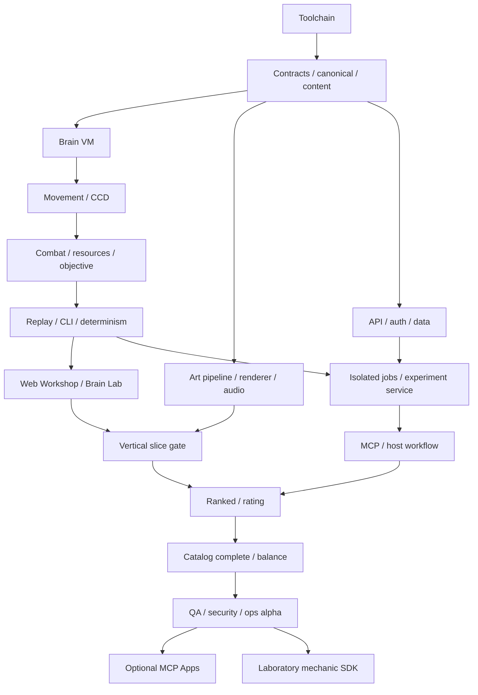

# 08 — Kế hoạch triển khai có thể giao Agent

**Đầu vào ban đầu:** repository chỉ tài liệu; không có engine/app/schema/test hay deployment v2. Kế hoạch không dùng các trạng thái M1/M2/M3 lịch sử làm dependency đã đạt. Chỉ triển khai theo nguồn chính thức [README](../README.md).

**Trạng thái triển khai:** G0 (T01–T03) được bàn giao cùng code, checks và [báo cáo evidence](../deliverables/implementation/G0_REPORT.md). T04–T16 chưa triển khai. Xem báo cáo để phân biệt checks đã chạy với remote CI/những gate giai đoạn sau chưa chạy; không suy game hoàn chỉnh từ G0.

## 1. Nguyên tắc giao việc

Mỗi ticket có một owner, input versions, owned paths, đầu ra, tests và evidence. Agent đọc01/02/03/04 và tài liệu domain trước code. Workspace task đã isolated: dùng checkout hiện có; không tạo worktree trừ người giao yêu cầu. Không spawn triển khai song song vào cùng package nếu chưa thống nhất interfaces; khóa shared schema/content do owner contracts quản lý.

Thay đổi gameplay/catalog/ABI phải cập nhật nguồn và fixtures cùng PR; không sửa số để một test pass mà bỏ mục tiêu. Design target chưa đo thì ghi unverified. Nếu acceptance chưa đạt, ticket incomplete; không gọi build thành công là fun gate hoặc mock OAuth là host integration. Agent có thể sửa routine implementation choices; thay đổi semantics phải ghi ADR+impact, không silent drift.

Chạy checks thích hợp một lần cho revision bàn giao; failure phải isolate/fix/reverify. Evidence ở `deliverables/implementation/Txx/<revision>/`: commands/exits, seed manifests, metrics, screenshot/video khi liên quan, limitations. Không invent command/test count. Các lệnh trong04 là **API scripts cần tạo bởi T01**, không executable hiện tại.

## 2. Mốc và gates

| Mốc | Ticket | Bàn giao | Gate bắt buộc |
|---|---|---|---|
| **G0 — Nền contracts** | T01–T03 | Workspace, schemas, canonical hash, Brain VM | Type/lint/boundaries; positive/negative schemas; IR semantics/gas |
| **G1 — Combat proof** | T04–T06 | Headless engine+CLI, 3 module slice, replay | Determinism/CCD/order/seek, adaptive behavior, initial fun test |
| **G2 — Premium vertical slice** | T07–T08 | Workshop+Brain Lab+Arena, art/audio, experiments | Full local loop, usability/readability/performance, counterplay |
| **G3 — AI platform** | T09–T11 | Backend/auth/jobs, MCP2, privacy | ACL/worker/fencing, modern protocol,2 actual AI hosts co-create |
| **G4 — Ranked alpha** | T12–T14 | Series/rating/leaderboard/admin, final5 modules | Idempotent ranked, full balance, security+load+restore+alpha signoff |
| **G5 — Mở rộng** | T15–T16 | Apps nếu host hỗ trợ, mechanic Laboratory SDK | Capability/host QA, extension budgets+version migration; không block core alpha |

Không thêm Lance/Breaker vào G1 trước thử Blade/Burst/Shield. Catalog đầy đủ02 là đích G4. Có thể thiết kế art kits cho cả5 sớm nhưng chỉ implement slice cần thiết. Ranked là G4 mandatory; Apps/Laboratory sau alpha là optional roadmap. G1 fun test là prototype gate, G2 quality gate chi tiết ở01/09.

## 3. DAG và song song an toàn



T08 asset authoring song song T03–T06 nhưng renderer integration chỉ sau replay/event contract02/04 freeze. T09 bắt đầu skeleton sau T02, deploy scaling không trước G1. T12 bắt buộc T10 privacy/finalization gate. Product/art review không được biến thành permission loop cho các lựa chọn user đã giao toàn quyền; gate dùng bằng chứng và quyết định có owner.

## 4. Ticket cụ thể

### T01 — Workspace và môi trường phát triển

- **Owner:** Foundation Agent. **Input:**04,08. **Paths:** root manifests/config,apps skeleton, CI, dev compose; không author gameplay trong ticket này.
- **Output:** exact Node24/pnpm10/tool versions, frozen lockfile, strict TS project references, boundary lint, local postgres/minio, env names không secrets, health/readiness và developer README.
- **Acceptance:** clean install/build/check trên Linux; Windows CLI CI job cấu hình; `pnpm dev` start smoke page/API health; stop/restart service do mình tạo; DB migration empty+repeat no drift. Pin dependencies đáp ứng MCP peer plan05; không ép extensions SDK1 vào server2.

### T02 — Contracts, catalog và canonical encoder

- **Owner:** Contract Agent. **Depends:**T01. **Input:**02/03/04/05/07. **Paths:**packages/contracts,content, testkit contract fixtures; schema refs docs.
- **Output:** JSON Schema2020-12 + TS types Bot/Brain/IR/Intent/Observation/Validation/Experiment/Replay/Match/Ratings; content alpha-0, version manifest, units/LUT, arena-init1225presets+seedmapping/suite-builder disjoint scenario IDs, six planned reference Body kits. Initial slice enabled catalog core/thruster/armor/blade/burst/shield/radiator/capacitor; Lance/Breaker marked not-enabled until T13.
- **Acceptance:** schema good/bad vectors, source/byte/nesting caps, grid overlap/connectivity/core 2x2/cost, canonical rename/order/metadata/presentation tests, cross-runtime hash parity; sample JSON validated or corrected with doc diff. Freeze contract API and generated schema digests before T03.

### T03 — Compiler và Brain VM

- **Owner:** Intelligence Agent. **Depends:**T02. **Input:**03. **Paths:**packages/brain, brain fixtures.
- **Output:** typed expressions, FSM, simultaneous writes, skill hygienic inline, sourceMap, gas, fault semantics, diagnostic pointers; parser/compiler bounded before allocation.
- **Acceptance:** tests for every opcode/sensor, short-circuit work count,4096/4097 gas, division0, macro cycles/expansion cap,10fault streak, held controls vs activation edges, module arbitration geometry ordinal, compare same inline skill behavior. No arbitrary host functions or Node I/O imports.

### T04 — Spatial và motion deterministic

- **Owner:** Simulation Agent. **Depends:**T03. **Input:**02§2,5,7/04§4. **Paths:**packages/engine geometry/movement/collision, spatial testkit.
- **Output:** fixed point helpers/remainders, LUT angles, locked mass/thruster torque, swept cell collision, solver iterations fixed, arena/tường, debug render fixtures.
- **Acceptance:** high-speed projectile/body cannot tunnel, rotation contact, multiple contacts, corners, exact overlap symmetric, freeze fallback diagnostic; pure whole-world180°/slot-label rename outcome symmetry (khác actual BO2 slot assignment) và module rename invariance. Profile candidate implementation; if solver semantics underspecified, propose numeric fixtures+ADR before damage. Do not swap in float physics to save time.

### T05 — Combat slice và objective

- **Owner:** Combat Agent. **Depends:**T04. **Input:**02. **Paths:**engine weapons/resources/destruction/objective, content slice brains.
- **Output:** Blade/Burst/Shield, energy/heat hysteresis, activation phases, self occlusion, shield batch, armor, damage simultaneous, connectivity, control/ring/timeout;3 archetypes Mantis/Bastion-lite/Kestrel.
- **Acceptance:** windup exactly18ticks, active single hit, burst offset0/4/8, projectile first-hit, opposing kill same tick draw, destroyed weapon already collected hit, shield2×resource fairness+largest remainder, ring remainder and tie100, no overkill/detach farm. Run same body passive/adaptive Brain scenario and trace action difference.

### T06 — Replay, CLI và reproducibility

- **Owner:** Replay Agent. **Depends:**T05. **Input:**03/04§7. **Paths:**packages/replay,apps/cli, testkit replay corpus.
- **Output:** public pose chunks/index/seek, private engine checkpoint/trace, archive binding verifier, integrity hashes, CLI offline validate/simulate/experiment/verify.
- **Acceptance:**1000 seed differential run same hash across Linux/Windows (browser-worker representative100), restore every checkpoint to same final state, arbitrary seek public frame equivalent straight playback, corrupt/missing chunk reject, public decoder never contains Brain/private energy, pipeline captures exit status. Publish reproducible seed/corpus manifest, not only a “passed” line.

### T07 — Workshop, Brain Lab và thí nghiệm local

- **Owner:** Frontend Agent. **Depends:**T06. **Input:**01/03/06. **Paths:**apps/web,design-system DOM components; renderer integrations through public API.
- **Output:** module grid editor undo/redo/import/export, Budget/occlusion diagnostics, Brain state/rule editor+trace, Behavior Card/lineage, paired A/B jobs local worker, compare and debrief turning event into hypothesis. Persist IndexedDB draft revisions local/unofficial, not localStorage ranked truth.
- **Acceptance:** fresh user creates→edit→validate→experiment→replay→revision; conflict-safe unsaved edits, JSON errors pointer, worker crash clear, keyboard controls, no full main thread engine import, mobile summary flow and no hidden disabled CTA. Playwright+usability sessions01 with actual participants.

### T08 — Art, renderer, animation và audio slice

- **Owner:** Technical Art Agent. **Depends:**T02, integration afterT06. **Input:**06 and02 public events. **Paths:**assets/source+generated,packages/renderer,dev/fx lab; tokens via design-system owner coordination.
- **Output:** authored coherent bot kits/arena, atlas licenses, VFX director, audio motifs, camera/presentation-only time mapping, high/medium/low tiers, context-loss recovery, event gallery and screenshot fixtures. Dummy assets allowed during G1, not final public G2 flow.
- **Acceptance:** full flow has no placeholder; shapes distinguish two teams in grayscale; telegraphs visible with VFX off; overlays no collider lie; seek reconstruct cosmetic state without persistent trails/audio; frametime/DPR/memory asset budget 09, browser/keyboard/contrast actual checks. QA owner independent assesses screenshots, not artist self-score.

### T09 — Application backend, auth và persistence

- **Owner:** Platform Agent. **Depends:**T02. **Input:**04/05/07/09. **Paths:**apps/api,packages/application,persistence/auth adapters,migrations.
- **Output:** shared REST/MCP use cases, subject/ACL, CAS drafts, immutable package store, audit, idempotency, quotas, same-origin session + OAuth metadata/provider spike, local stage deployment.
- **Acceptance:** two-user cross-access fail uniformly, source projections, CSRF, scopes+issuer/audience/revoke, revision race and duplicate key, dynamic metadata SSRF controls, secret/log redaction, migrations repeat/upgrade rollback-compatible. Provider incompatibility requires supported replacement ADR, not unsafe token forwarding.

### T10 — Workers, experiments và artifact finalizer

- **Owner:** Reliability Agent. **Depends:**T06+T09. **Input:**04/05/09. **Paths:**apps/sim-worker, application jobs/experiments, storage adapters, observability.
- **Output:** leased/fenced jobs+outbox, OS isolated process, signed release allowlist, deterministic artifact projection, reserved/refunded quotas, batch comparisons, trusted completion verifier.
- **Acceptance:** kill/restart at enqueue, lease, running, upload, object commit, DB commit, publish; stale fence rejected; no duplicate charge/result; private blob forbidden public, signature/key mismatch rejected, jobs no egress/secrets OS test; unit quota cancellation race. Load CPU/wall budgets on recorded reference host.

### T11 — MCP2 và AI co-create

- **Owner:** MCP Agent. **Depends:**T10. **Input:**05 supporting current SDK docs. **Paths:**packages/mcp-adapter, agent.md resources, protocol/host test fixtures.
- **Output:**16 documented tools, schemas/common errors/pagination, modern stateless HTTP + local stdio, discovery, explicit human review intent web, optional verified legacy path separated.
- **Acceptance:** client pin2026-07-28 packet evidence header/meta/errors/outputSchema; CAS/idempotency; two named actual AI host versions full hypothesis→edit→validate→experiment→compare→freeze; forged human consent rejected and legitimate web fallback submit works. Chat rendering deferredT15, no fake UI claims. No new domain rules in MCP adapter.

### T12 — Ranked, rating và leaderboard

- **Owner:** Competitive Agent. **Depends:**G2,T10,T11. **Input:**07. **Paths:**application ranked/matchmaker/rating, migrations/ledger,web ranked views/admin.
- **Output:** one-entry account queue, two counterbalanced legs, exact bindings, rating ledger atomic, public leaderboard snapshots, provisional eligibility, cancel/season closure, admin pause/disputes.
- **Acceptance:** fixtures Elo values07, ledger zero-sum/retry, concurrent submit/rating, same-user rejection, no rematch farm, offline queued status, timeout/draw, both legs required, missing/corrupt replay not rated, snapshot pagination, restart unchanged result. Include season transition staging rehearsal.

### T13 — Complete catalog và balance proof

- **Owner:** Gameplay Agent. **Depends:**T12. **Input:**02/01. **Paths:**engine Lance/Breaker + extension hook boundaries,content six bots+Brain variants, experiment suite.
- **Output:** final5 active module catalog + six archetypes, seeds regression/holdout, matchup matrix, resource/motion metrics, behavior cards, adversarial compositions. All first-pass numbers remain candidate until measured.
- **Acceptance:**4200 full reference matches per02 +2400 paired Brain holdout legs per09 plus exploit set; fun/readability/hypothesis metrics01/09; no single fixed body/Brain template dominates;3 same-body intelligence improvements; safety validation allows turret/kiting tactics while objective punishes no engagement. Tune with experiment record, bump digest/revalidate. Failure keeps alpha closed; do not weaken thresholds silently.

### T14 — Independent QA, security và alpha release evidence

- **Owner:** QA Agent; Security reviewer domain owner. **Depends:**T13. **Input:**09 + artifactsT01–13. **Paths:**testkit/tests/deployment docs/release evidence; no unrelated features.
- **Output:** functional/negative/fault/load/accessibility test report, real browser screenshots/video, actual host matrix, backup restore drill, incident switches, release manifest signed, capacity/cost estimate with measurements, known limitations.
- **Acceptance:** all mandatory09 gates pass for exact revision; P0/P1 unresolved block ranked; hard failure remains failed. Actual owner launch decision after engineer review. Buildable game local/staging + reusable setup/start instructions in environment config if requested workflow includes cloud onboarding; do not claim publish/deploy merely from saved config. Rollback rehearsed and queue drain safe.

### T15/T16 — Sau alpha

T15 MCP Apps reuse viewer with isolated bridge dependency graph05, capability matrix and real host render tests, tools-only fallback. T16 Laboratory authored mechanics SDK03: pure hooks, operation/entity quotas, codec/events, proposal review pipeline, sample mechanic, sandbox benchmark, season promotion gate. Neither introduces custom mechanics directly into active ranked; neither cancels missing workT14.

## 5. Prompt giao Agent dùng ngay

```text
Bạn nhận ticket Txx trong docs/v2/08_IMPLEMENTATION.md.
Đọc README và các nguồn domain của ticket; checkout hiện có là workspace
isolated, không tạo worktree nếu không được yêu cầu. Chỉ sửa owned paths;
interface shared thay qua Contract owner. Nêu input digests và assumptions.
Triển khai đầy đủ output; khi fail isolate→fix→rerun affected check.
Không đổi luật/ABI/score/quotas để làm test pass; đề xuất ADR nếu cần.
Không secrets trong repo/log; không ảnh hưởng production khi task local.
Bàn giao files, diff, commands+exit codes, artifacts theo revision,
passed/failed/skipped/unrun riêng, blockers và next dependent ticket.
Ticket chỉ complete khi acceptance thực sự đạt; plan/reference docs không
là evidence triển khai. Commit/push/deploy theo ủy quyền task thực tế.
```

## 6. Nhân lực, thời gian và điểm dừng

Để lập kế hoạch ban đầu, giả định một engineer owner,2–3 coding Agents có reviewer, một technical artist/audio contributor part-time và12–20 người playtest. Agent không thay nhu cầu author assets/QA trên máy thật. Ước lượng **không cam kết**:G0 1–2 tuần,G1 2–4,G2 3–5,G3 2–4,G4 2–4, tổng10–19 tuần với một số phần song song; hiệu chỉnh sauT04/T08 bằng measured throughput. Nếu chỉ một người/Agent, giữ gates và giảm số việc song song, không hứa timeline này.

Rủi ro cao nhất: collision determinism, combat không vui, asset pipeline vượt budget, OAuth host divergence, job/rating races. Prototype/bench spikesT04/T08/T09 xử trước scale. Dừng expansion nếu replay parity fail; dừng ranked nếu integrity/ACL fail; dừng asset proliferation nếu chưa đạt readability. Đầu ra mỗi gate phải làm được một vòng người chơi thật, không collection nhiều service chưa nối.
